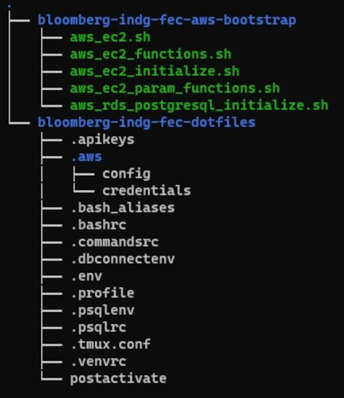
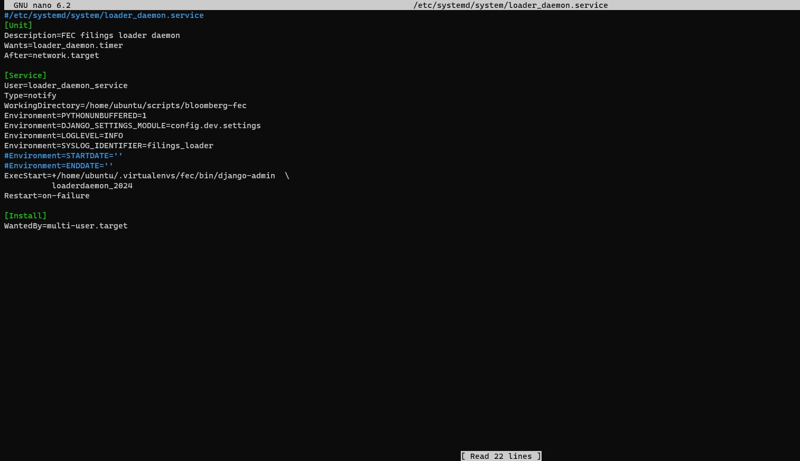
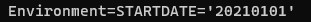

#<a name="gs_about">About this tutorial</a>

This tutorial explains how to use the FEC application by walking through its installation and by analyzing some campaign finance data. The objective is to teach how to use the tool by presenting it using real world examples.

The campaign finance data we will be using comes from campaign reports submitted to the [United States Federal Election Commission](https://www.fec.gov/). The application fetches and loads required periodic reports submitted by campaigns \([Form F3](https://www.fec.gov/) for congressional candidates, [Form F3P](https://www.fec.gov/) for presidential\), political parties and PACs \([Form F3X](https://www.fec.gov/)\) and independent expenditure reports from Super PACs, individuals and groups \([Form F24](https://www.fec.gov/) for Super PACs or [Form F5](https://www.fec.gov/) for the others\). These reports contain detailed financial information about political activities, including contribution and spending amounts and dates and identifying information for contributors and payees.

We'll also customize the application to facilitate filtering out noise so we can focus on the information we care about.

The installation section of this tutorial will be easier to follow if you have some basic familiarity with the command line. If that doesn't describe you, don't despair. This has been written for novices too. Prior experience with data processing or analysis isn't assumed. Familiarity with federal campaign finance data is assumed, though some concepts are explained.

This tutorial explains how to:
  
1. [Install](#gs_installation) the application and automatically download campaign filings as they become available on the FEC's website and load them into the database.  
2. [Analyze](2_interviewing_data.md) the filings, either through the built-in web interface or by connecting to the underlying PostgreSQL database.

##<a name="gs_installation">Installation overview</a>
The Bloomberg Industry Group Data Desk campaign finance system is designed to track and analyze campaign reports from the Federal Election Commission. The system's main building blocks are a web application, written in the popular Python web framework Django, and a back end PostgreSQL database. The back end database and web application are hosted on separate Amazon Web Services (AWS) virtual cloud servers.

Installation instructions require the user to run a terminal with a <b title="The default shell isn't always Bash, for example on Ubuntu. Use the 'bash' command and not 'sh.'">Bash shell</b> on an internet-connected client computer and have an AWS account. If it's not already setup on the client computer, install the [AWS Command Line Interface \(AWS CLI\)](https://docs.aws.amazon.com/cli/latest/userguide/cli-chap-install.html) and configure it for your account. You can also use an alternate AWS IAM profile for the installation if one exists and has been set up in your account credentials \(see [below](#gs_profile) for instructions on how to enable this\).

The installation will create a remote PostgreSQL database on AWS RDS and a remote AWS EC2 instance running the latest LTS version of Ubuntu Linux.

All of the install scripts are contained in the repository [bloomberg-indg-fec-aws-bootstrap](https://github.com/capitolmuckrakr/bloomberg-indg-fec-aws-bootstrap), which should be copied to your client computer. Special "dotfiles" are in the archive bloomberg-indg-fec-dotfiles.zip which should be unzipped to a directory on the same level on your client machine as the bloomberg-indg-fec-aws-bootstrap directory. Your directory structure should look like the following, wherever you store the files:

||
|::|
||
|*Figure 1. Installation directory tree.*|

For this tutorial, we'll copy the necessary directories into our "home" directory on our client computer. On Mac OS, this is the directory '/Users/myusername,' on other *nix-like systems it's usually '/home/myusername,' and most systems will drop you right into it when you open a Bash terminal. We'll refer to the home directory using the built-in shortcut '~/' for both Mac and Linux. Note that you can place the directories anywhere you like where your account has full read and write privileges. For example, I create a 'scripts' directory inside my home directory on every system I use and then put my project directories inside it.

To start the installation, open the Bash terminal now and from your home directory, change into the directory containing the install scripts:
```
~$ #Your 'prompt' may look different, depending on your client system settings.
~$ #Commands are entered following the '$' sign for most prompts.
~$ #If you're cutting and pasting the commands, paste after the '$' to the end of the line.
~$ cd ~/bloomberg-indg-fec-aws-bootstrap
```

##<a name="gs_creating_database">Creating the database</a>
To create the database, we need to assign the credentials to access it. We'll choose the name of a master account as the owner and manager of the database and set a password for that account. Later, we'll create user accounts on the database, but we need to set this account first.

Choose and save a name and a password for the master database account. On your client computer, set the name and password as environment variables.
The master name variable should be called **PGUSER**.

```
~/bloomberg-indg-fec-aws-bootstrap$ export PGUSER=bloomberg_fec
```
  
The master password variable should be called **PGPASSWORD**. 

```
~/bloomberg-indg-fec-aws-bootstrap$ export PGPASSWORD='demo#password' #Pick a real password
```


To use an alternate IAM <a name="gs_profile">profile</a> for the installation, assign the 'profile' environment variable. You'll first need to setup the AWS CLI to use an IAM role by editing your ~/.aws/config, see the AWS CLI documentation on [IAM roles](https://docs.aws.amazon.com/cli/latest/userguide/cli-configure-role.html) for more information.

For example, to run the installation using a profile named projectrole, assign the profile variable like this:

```
~/bloomberg-indg-fec-aws-bootstrap$ export profile='projectrole'
```

The database installation script defines several default values for parameters used to create the database. It's not necessary to change them. Optionally, you can overwrite the values for one or more parameters by assigning the environment variable for the parameter before running the script, using the 'export VAR=value' syntax.

The variables and their corresponding default values are listed, along with a description of the parameters they control:

**VPCID** -- the virtual private cloud to use. The default VPC for the account or profile will be used unless a different ID is assigned.

**SGNAME**=bloomberg-fecproject -- the security group to use for the database, it will be created in the assigned VPC if it doesn't already exist.

**DB_NAME**=fec2024 -- the name for the database.

**DB_INSTANCEID**=fec2024 -- the name for the RDS instance hosting the database. The name should not match the name of any database instance belonging to the account.

**DB_STORAGE**=150 -- the amount of disk space in GB to assign to the database.

**DB_INSTANCECLASS**=db.t3.large -- the instance class to use, it determines the processing power and speed for the database.

To create a database for the project, run the script aws_rds_postgresql_initialize.sh.
The terminal will print out the values set for the database parameters, followed by the message "waiting for bloomberg-indg-fecproject ..."

    ~/bloomberg-indg-fec-aws-bootstrap$ bash aws_rds_postgresql_initialize.sh
    vpc-4841f92d #the id of the virtual private cloud
    bloomberg-fecproject #the name of the security group
    fec2024 #the name of the database
    fec2024 #the name of the RDS instance
    150 #the database disk space size in GB.
    db.t3.large #the instance class of the database
    waiting for fec2024 ...

In addition to starting up a new database, the install script exports the URL of the database to the variable ENDPOINT_DB and writes it and the other environment variables to dotfiles, replacing placeholder values in the files. The files are then added to a compressed archive in the current directory, **bloomberg-indg-fec-dotfiles.tar.gz**. The archive will be uploaded to the EC2 server running the application.

It will take 10-15 minutes for the database to be created using the default values. Once the database is ready, the terminal will print out a message with the database URL, similar to:
```
fec2024 is available and listening on [fec2024.a9bc8defgh7z.us-east-1.rds.amazonaws.com] # your database URL may appear different
Type 'terminate_db' to shut down, backup and delete the database.
```
##<a name="gs_create_server">Creating and configuring the application server</a>
Before creating our application server, we need to choose a key pair, a file containing public and private keys that we will use to access the server. The file name for the key pair should match the key pair name and should be a PEM file with the '.pem' extension. It also should not include any spaces or dashes in the file name.

If you don't already have a key pair in your AWS account you want to use, you can create one or import an existing key by visiting the [key pair page](https://console.aws.amazon.com/ec2/v2/home?region=us-east-1#KeyPairs:) in the AWS console, under the EC2 service. Visit the page and create a new key pair named 'mykey' and save it using the console dialog window that appears. Move the resulting file named 'mykey.pem' to your client machine and save it in your home directory. You'll need to change the access permissions of the key file to be read-only for just the owner before you can use it. This ensures that the file is only usable under your specific user account. To view and change the permissions, type the following commands:
```
~/bloomberg-indg-fec-aws-bootstrap$ ls -l ~/mykey.pem # list the file and view its permissions.
-rw-r--r--. 1 myusername myusername 1674 Jul 20 16:00 /home/myusername/mykey.pem #the file can be read or written to by the owner but only be read by anyone else.
~/bloomberg-indg-fec-aws-bootstrap$
~/bloomberg-indg-fec-aws-bootstrap$ chmod u=r,g=,o= ~/mykey.pem && ls -l ~/mykey.pem #change the file access permissions and list it again.
-r--------. 1 myusername myusername 1674 Jul 20 16:00 /home/myusername/mykey.pem #access is now read-only and solely for you, the file's owner.
```
You'll need to assign the location of your key pair file to the environment variable PEM. For example, if your key pair file is named 'mykey' and is located in your home directory, you would issue the following command:

```
~/bloomberg-indg-fec-aws-bootstrap$ export PEM='~/mykey.pem'
```

Like the database installation script, the application server installation script uses default values for parameters used to create the EC2 instance.  Optionally, the default values for one or more parameters can be overwritten by assigning the environment variable for the parameter before running the script, again using the 'export VAR=value' syntax.

The variables and their corresponding default values are listed, along with a description of the parameters they control:

**AMIID** -- the ID of the Amazon Machine Image used to launch the instance. The default is the most recent HVM image from the latest LTS version of Ubuntu Server. When setting a different image, choose an HVM Ubuntu one. You can read more about Amazon Machine Images [here](https://docs.aws.amazon.com/AWSEC2/latest/UserGuide/AMIs.html) or search for images [here](https://cloud-images.ubuntu.com/locator/ec2/).

**INSTANCETYPE**='t3.large' -- the instance class to use, it determines the processing power and speed for the EC2 server.

To create and setup the application server, run the script aws_ec2.sh.

    ~/bloomberg-indg-fec-aws-bootstrap$ bash aws_ec2.sh

The terminal will print out the values set for the server parameters, followed by the message "waiting for i-{alphanumeric ID that uniquely identifies the server} ..."
It will take several minutes for the server to be created and have everything installed.

Once the server is created, the terminal will print out a message similar to: i-0a123b456cd7e8910 is accepting SSH connections under ec2-1-23-456-789.compute-1.amazonaws.com, with the instance id and URL of the server that was just created. The terminal will also print out instructions for shortcut commands to connect to the server or to upload files.

    ~/bloomberg-indg-fec-aws-bootstrap$ bash aws_ec2.sh
    ami-046842448f9e74e7d #the image id used for the server.
    vpc-4841f92d #the id of the virtual private cloud
    subnet-43475c6b #the id for the pool of internet addresses the server belongs to.
    t3.large #the instance class of the server
    bloomberg-fecproject #the name of the security group
    waiting for i-0a123b456cd7e8910 ... #only an example id
    Warning: Permanently added 'ec2-1-23-456-789.compute-1.amazonaws.com,1.23.456.789' (ECDSA) to the list of known hosts.
    bloomberg-indg-fec-dotfiles.tar.gz #the dotfile archive uploaded to the server
    waiting for i-0a123b456cd7e8910 ... #only an example id
    Type 'connect' to access the server
    Type 'upload [FILEPATH]' to send a file to the server.
    i-0a123b456cd7e8910 is accepting SSH connections under ec2-1-23-456-789.compute-1.amazonaws.com #example instance id and URL.
    
Although the server has been created, it needs another few minutes to install and start the application. You can monitor the installation progress by connecting to the server and reading the install log. Follow the instructions and enter 'connect' to log in to the server. Your client machine will connect and the following information about the server will be printed to the terminal.

    ~/bloomberg-indg-fec-aws-bootstrap$ connect
    Warning: Permanently added 'ec2-1-23-456-789.compute-1.amazonaws.com,1.23.456.789' (ECDSA) to the list of known hosts.
    
    Welcome to Ubuntu 18.04.4 LTS (GNU/Linux 4.15.0-1058-aws x86_64)
    
     * Documentation: https://help.ubuntu.com
     * Management:    https://landscape.canonical.com
     * Support:        https://ubuntu.com/advantage

     System information as of Sat Jul 20 21:45:18 UTC 2019

     System load:  0.29              Processes:           110
     Usage of /:   3.0% of 61.98GB   Users logged in:     0
     Memory usage: 3%                IP address for ens5: 172.31.40.245
     Swap usage:   0%


     0 packages can be updated.
     0 updates are security updates.
     Last log in: Sat Jul 20 21:45:18 2019 from 93.184.216.34
     To run a command as administrator (user "root"), use "sudo <command>".
     See "man sudo_root" for details.
     
Your command prompt will change to show the current user, 'ubuntu,' and the AWS internal IP address, similar to an email address.

To view the install log as it gets updated, type the following command:
   
    ubuntu@ip-172-31-44-100:~$ tail -f /var/log/instance-setup.log
   
The log will scroll by quickly. Once the server is done setting everything up for the application, you'll be disconnected as the server reboots. Wait a few seconds for it to restart and you'll be able to join the server again with the 'connect' command.

To make sure the server is up and running, copy and paste the server URL to your web browser. Note that the server is firewalled; you'll only be able to access it from the internet address of the client computer you used for the installation. To give other users access, you can add their IP addresses to the security group for the server and the database in the [AWS console](https://console.aws.amazon.com/ec2/v2/home?region=us-east-1#SecurityGroups:sort=desc:ipPermissionsIngress).

The server internet address can be obtained from the command line of the installing client by typing the following command:
```
~/bloomberg-indg-fec-aws-bootstrap$ echo $ENDPOINT
ec2-1-23-456-789.compute-1.amazonaws.com
```

##<a name="gs_get_load_data">Getting and loading the data</a>

When the application is first installed it won't contain any data. The application includes a loader library to query and download campaign filings from the FEC and then load them into the application's underlying database. The file path for the loader library is [cycle_2024/utils/loader.py](https://github.com/capitolmuckrakr/bloomberg-fec/blob/cycle2024/cycle_2024/utils/loader.py). A special command, loaderdaemon_2024.py, located at [cycle_2024/management/commands/loaderdaemon_2024.py](https://github.com/capitolmuckrakr/bloomberg-fec/tree/cycle2024/cycle_2024/management/commands/loaderdaemon_2024.py), utilizes the loader library to fetch filings from the FEC and load them into the database.

Loading filings into the application uses functions divided into three major categories:

1.  Create a list of filings to download \( [get_filing_list](https://github.com/capitolmuckrakr/bloomberg-fec/blob/cycle2024/cycle_2024/utils/loader.py#L39) \)

    * Query the FEC for a list of campaign filings \(.csv files\), using the FEC API. The resulting list of filings can be screened to eliminate already saved filings, unneeded filings such as forms 1 and 2 and amended filings outside the current cycle.
    
2.  Download the filings \( [download_filings](https://github.com/capitolmuckrakr/bloomberg-fec/blob/cycle2024/cycle_2024/utils/loader.py#L206) \)

    * Takes a list of one or more filing ids as a parameter and downloads them to a designated or default directory.
    
3.  Load any new filings into the database \( [load_filings](https://github.com/capitolmuckrakr/bloomberg-fec/blob/cycle2024/cycle_2024/utils/loader.py#L806) \)

    * Cycle through a directory of filings and parse any unrecorded filings by form type and conduct validation tests. Load filings into the database if they pass the applied tests, and adjust the data in certain cases. Record the results of the tests for each filing in the database.
    
Further documentation for the library is described in the reference section.

The application server includes a service \(the programming term is system daemon\) named **loader_daemon**, that uses the loader library to automatically check the FEC website for any new campaign reports, fetch them and load them into the application database. When the server is first installed, the service is disabled and needs to be activated before it will start operating.

You can get an update on the status of the service by typing the following command:

    ubuntu@ip-172-31-44-100:~$ systemctl status loader_daemon
    ● loader_daemon.service - FEC filings loader daemon
       Loaded: loaded (/etc/systemd/system/loader_daemon.service; disabled; vendor preset: enabled)
       Active: inactive (dead)

The service is configured to search for any campaign reports submitted within the last two days, using the FEC's API. We'll need to edit the service file for our first load if we want earlier campaign reports.

Before we edit the service file, let's take a quick look at it. The location of the file is listed in the information printed out when we requested the service status. Type the following command into the terminal to view the file:
```
ubuntu@ip-172-31-44-100:~$ cat /etc/systemd/system/loader_daemon.service
#/etc/systemd/system/loader_daemon.service
[Unit]
Description=FEC filings loader daemon
Wants=loader_daemon.timer
After=network.target

[Service]
User=loader_daemon_service
Type=notify
WorkingDirectory=/home/ubuntu/scripts/bloomberg-fec
Environment=PYTHONUNBUFFERED=1
Environment=DJANGO_SETTINGS_MODULE=config.dev.settings
Environment=LOGLEVEL=INFO
Environment=SYSLOG_IDENTIFIER=filings_loader
#Environment=STARTDATE=''
#Environment=ENDDATE=''
ExecStart=+/home/ubuntu/.virtualenvs/fec/bin/django-admin\
          loaderdaemon_2024
Restart=on-failure

[Install]
WantedBy=multi-user.target
```
We won't go into what most of the commands in the file do since we're only interested in the 'Environment' directives, which set environment variables like the ones we used earlier. We want to edit one of the two directives that are commented out, **STARTDATE**.

To load earlier campaign reports we need to add a starting date value to the **STARTDATE** parameter. We can ignore the **ENDDATE** parameter, but if you wanted to limit loading to a period before the present, you can do that by assigning a date to it as well.

To edit the file, we'll use nano, a light-weight editing program included with Ubuntu. Feel free to use a different editor such as Vim or Emacs if you have a preference.

Type the following command to start editing:
```
ubuntu@ip-172-31-44-100:~$ sudo nano /etc/systemd/system/loader_daemon.service
```
The display will change when we open the editor to the following:

||
|::|
||
|*Figure 2. Editing the loader_daemon.service file.*|

Use your cursor to move down to the line with the **STARTDATE** parameter and delete the '#' sign at the beginning of the line. Enter the date you want as your starting point for searching and loading campaign reports between the quote marks, in the format YYYYMMDD. For example, to start loading reports on or after Jan. 1, 2021, you'd enter '20210101' as your starting date. The line would then look like this:

||
|::|
||
|*Figure 3. Setting the loader_daemon.service __STARTDATE__ parameter .*|

Once you've made the change, type Ctrl-X and the editor will display 'Save modified buffer?' Type 'Y' to save the file and hit enter and then enter again to save it with the same name. If you make any mistakes or accidentally erase or alter part of the file, refer to the [original version](https://github.com/capitolmuckrakr/bloomberg-fec/blob/cycle2024/systemd/loader_daemon.service) of the loader_daemon.service file. You can also undo any changes by copying the original version of the file located in the application directory on the server with the following command:
```
ubuntu@ip-172-31-44-100:~$ sudo cp ~/scripts/bloomberg-fec/systemd/loader_daemon.service /etc/systemd/system/
```

Once you've saved the edited service file, it needs to be reloaded before the changes can be applied. To reload the file, enter the following command:
```
ubuntu@ip-172-31-44-100:~$ sudo systemctl daemon-reload
```
Once the service has been reloaded, you can start it and monitor its progress with the following command:
```
ubuntu@ip-172-31-44-100:~$ sudo systemctl start loader_daemon; journalctl -u loader_daemon -f
```
This may be a good time to get a snack. Depending on the start date you specified, fetching and loading all of the reports may take a few hours.

Once the initial load has finished, you should edit the loader_daemon.service file again to comment out the **STARTDATE** line. Then reload the service file again with the 'sudo systemctl daemon-reload' command to apply your edits and restart the service with the 'sudo systemctl start loader_daemon' command.

##<a name="gs_review">Review</a>
In the first part of this tutorial we set up our application to run on the AWS cloud. We created a PostgreSQL <a href="#gs_creating_database">database</a> instance using the AWS RDS service, as well as an application <a href="#gs_create_server">server</a> running Ubuntu, hosted on the AWS EC2 service. The server installation included all of the necessary software to run the application, which we saw when we viewed the installation log. We also <a href="#gs_get_load_data">loaded</a> campaign reports into the application and learned how to stop, start and check the status of the loader_daemon service that automatically fetches and loads campaign reports.

When everything is up and running to your satisfaction, you can move on to [Interviewing the data]().
