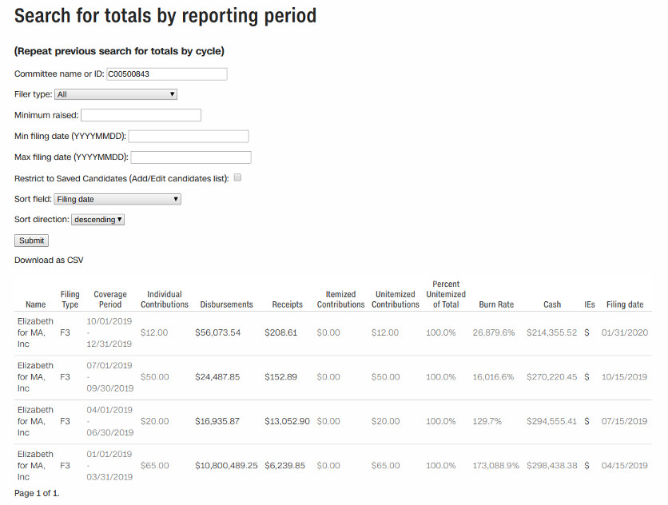
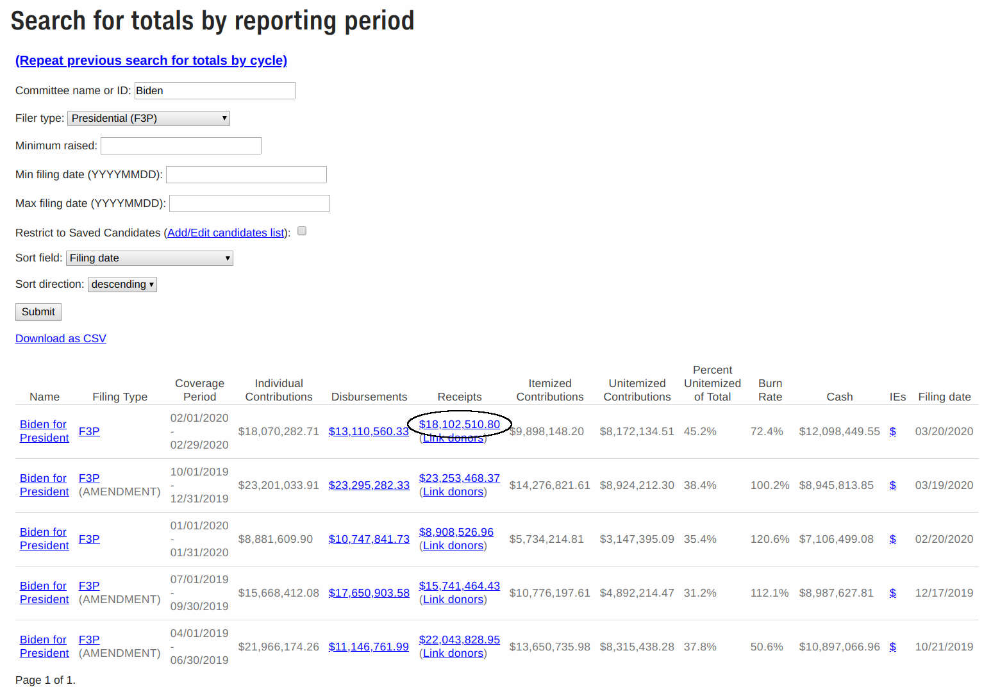
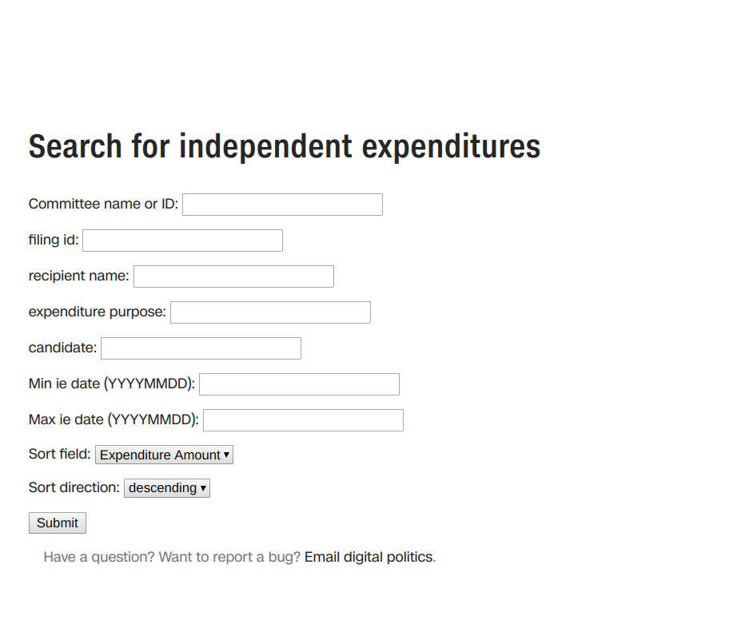

#<a name="intdata_web">The web interface</a>
We should have our application up and running, so we can use the web interface to explore the data. If you don't remember the URL of the server, you can get it from the [AWS EC2 console](https://console.aws.amazon.com/ec2/v2/home?region=us-east-1#Instances:sort=launchTime). 

Open the URL in your browser and you'll land on the welcome page.

||
|::|
||
|*Figure I. FEC application welcome page.*|

There's not much there,right? That's because the app is designed to nest applications for two-year [election cycles](https://www.opensecrets.org/resources/learn/glossary.php#E). Click on "Get 2024 data" to see the page for the 2024 cycle.

||
|::|
||
|*Figure II. FEC application cycle page.*|

The 2024 cycle page includes links to pages that allow you to search for and view slices of data from the loaded campaign reports. There's also a menu bar that's at the top of every search and display page for the 2024 cycle. The menu has links to the most important pages so that you don't need to jump back to the 2024 cycle page to view different types of data.

Several of the linked pages correspond to different sections appearing in campaign reports. We'll start by exploring the Summaries page, which includes aggregate information that political campaigns and groups include at the beginning of the periodic reports they file. Click on Summaries now to visit the page.

##<a name="intdata_web_summaries">Summary search page</a>
||
|::|
||
|*Figure III. FEC application summary search page.*|

When you open the page, you'll see a search box at the top with several different search options. Underneath the search box is a table showing summary information by reporting period for every report that's been loaded into the application, plus a link above the table to export the summary information to a CSV file. The summary table is sorted by default in reverse chronological order by the most recent campaign report filed with the FEC.

The form's search boxes, check boxes and dropdown menus allow you to filter your search, select a column to use for sorting your search and sort the selected column in ascending or descending order. We'll go through each of the options before trying out some practice searches.

> - **Committee name or ID** -- Filter the search by typing into the box either the full committee name, part of the committee name such as "Trump," or an FEC committee ID, for example entering "C00580100" would restrict the search to Donald Trump's presidential campaign committee. This is a full-text search, so the order of search terms isn't important and capitalization is ignored. The full-text search being used is also a fuzzy search, which means that the search returns results that are similar to the search terms instead of returning exact matches.

> - **Filer type** -- A dropdown menu that filters by the report type. Different types of committees have their own subset of forms that they file.

> - **Minimum raised** -- A search box that filters by the amount reported in the "Receipts" column, which is the total raised in the reporting period, including contributions, money transferred in from another campaign or committee, bank interest and any other funds the group filing the report received. You can raise or lower the amount by using up and down toggles that appear inside the box once it's selected. 

> - **Min filing date (YYYYMMDD)** and/or **Max filing date (YYYYMMDD)** -- Limit reports to those after or before a specific date.
> > Enter the date you want as your starting point for searching campaign reports in the format *YYYYMMDD*. *YYYY* is a four-digit calendar year, *MM* is a two-digit month, padded with a zero on the left for any month before October and *DD* is a two-digit date, padded with a zero on the left for dates below 10. For example, to search for reports on or after Jan. 1, 2021, you'd enter "20210101" as your start date in the minimum date box and to further limit the search to reports on or before Jan. 31, 2021, enter "20210131" as your cutoff date in the maximum date box.

> - **Restrict to Saved Candidates (Add/Edit candidates list)** -- Toggling this checkbox limits the search to a list of candidates. The list can be created and edited by using the application's Administration module that the data desk can access.

> - **Sort field** -- A dropdown menu that allows you to sort the summary information table by one of its columns.

> - **Sort direction** -- Whether to sort the summary information table in ascending or descending order.

###Search for a candidate's reports
Your search results may look a bit different than what's pictured in the examples that follow because the application loads new reports as they come in. It also deactivates any reports that are superseded by amendments and displays the amended report instead.

Let's try searching for Elizabeth Warren's Senate campaign. Select the **Filer type** dropdown and select the third choice, "House or Senate (F3)", which limits the search to congressional candidates.

||
|::|
||
|*Figure IV. Search for House/Senate candidate report summaries.*|

Type "warren" into the **Committee name or ID** search box and hit the **Submit** button. The application returns a few rows of results, but nothing for Elizabeth Warren!! The search function isn't case-sensitive, so the problem isn't that we typed "warren" instead of "Warren." But the search only looks for the name of the **actual committee**, not the name of a candidate. Let's try again, this time typing "elizabeth" into the search box instead, then hit "Submit" again.

||
|::|
||
|*Figure V. Looking for Elizabeth.*|

Unfortunately, there are a bunch of reports from different campaigns that include the name "Elizabeth." Which campaign is the one we're searching for isn't clear.

We can filter the list a bit more and keep the filters we already have. Scrolling down the table we can see that one candidate hasn't raised anything in the current cycle, so go to the **Minimum raised** search box and enter "1" to eliminate any reports with nothing raised from the search results. Focus on more recently filed reports and filter out anything filed before the beginning of 2020 by entering "20200101" in the **Min filing date** search box. Go ahead and hit **Submit**.

||
|::|
||
|*Figure VI. Refining our search.*|
_____________________________________________

We're left with five campaign reports. The report listed in the second row was filed by "Elizabeth for MA, Inc." We can see if it's Warren's Senate campaign. The form "F3" under the "Filing Type" column in the row is a link to a copy of the report on the FEC website. Click on the link to visit the FEC website and see the report.

||
|::|
||
|*Figure VII. Link to the FEC's copy of the report.*|

||
|::|
||
|*Figure VIII. FEC's copy of the report.*|

The FEC's version of the report tells us this is a Senate campaign report because no House district is listed, which is indicated by "State is Massachusetts in District: 0."

There are a few barely noticeable links underneath the banner at the top of the page as well, including a **COMMITTEE DETAILS** link to a page about the campaign committee that filed the report. Click on the link to visit the details page. There's a box indicating the authorizing candidate for the campaign committee, "WARREN, ELIZABETH" in this case, confirming it's her campaign.

||
|::|
||
|*Figure IX. Warren's Senate campaign FEC committee detail page.*|

Now that we've found Warren's Senate campaign, we can see her Senate campaign's committee ID below her name on the FEC committee detail page, "C00500843".

||
|::|
||
|*Figure X. Warren's Senate campaign FEC committee id.*|

Move back to the summary search page and click on the **SUMMARIES** link on the menu bar to clear the page. Type the committee id, "C00500843", in the **Committee name or ID** search box and hit **Submit**. If we know the committee's id we can filter for just its reports without intermediate steps.

||
|::|
||
|*Figure XI. Summary search by committee id results.*|

The summary table contains several links to other application pages as well as the links to the FEC's website we just covered.

||
|::|
||
|*Figure XII. Summary search results table links.*|

1. The amounts shown in the summary table are limited to the period of the report and are pulled from the report's "Column A" reporting figures. By clicking on the **Repeat previous search for totals by cycle** link, any filter we've set up in the form is applied for cycle totals. We can see the cumulative totals as of each report for the entire two-year reporting period, drawn from each report's "Column B" figures. This even applies to PAC and Party committees, which only report cumulative totals for the calendar year of the report. The application sums the PAC and Party yearly totals from the current year (the even year) and the yearly totals from the last report of the previous year (the odd year) for each committee during the loading process, and displays the latest cycle total figures for each listed report.

2. Export the results of a search to a downloadable CSV file that can be imported into another application for further analysis.

3. Links to the committee page, discussed in the [next section](2_interviewing_data.md#intdata_web_committee).

4. Links to a copy of the report on the FEC's website.

5. Links to the **Search for expenditures** page, with search results filtered for the particular campaign report that's listed.

6. Links to the **Search for receipts** page, with search results filtered for the particular campaign report that's listed.

7. Links to the **Search for independent expenditures** page, with search results filtered for the particular report that's listed. Since candidates don't make independendent expenditures, there are no amounts to display for our current search. If we had searched for a Super PAC instead, there would be amounts in this column, pulled from the Super PAC's Form 24 reports on independent spending or Schedule E of Form 3X. The amounts would link to a filtered view of the independent expenditures from that particular report.

||
|::|
||
|*Figure XIII. Summary search results table link to committee page.*|

##<a name="intdata_web_committee">Committee page</a>
You can visit the application's page for any committee, which lists all of its loaded reports. Start with the search we did earlier on the summary search page for Elizabeth Warren's Senate campaign and click on the committee name, "Elizabeth for MA," listed in the **Name** column of the summary table:

||
|::|
||
|*Figure XIV. Summary search results table links to other pages.*|

The committee page contains links to other application pages and to the FEC's website.

1. Link to the **Search for receipts** page, which allows you to search for itemized contributions and other receipts. Following the link brings you to the page, in this case filtered by committee id to limit the results to only the receipts received by Warren's Senate campaign. There are several filters that will be explained when we cover the **Receipts** page in more detail. 

2. Link to the **Search for expenditures** page, which allows you to search for itemized expenditures. Again, the search results have been filtered to show only expenditures by Warren's Senate campaign.

3. Links to the FEC's copies of the filed reports on the agency's website.

4. Links to the **Search for receipts** page, with search results filtered for the particular campaign report that's listed.

5. Links to the **Search for expenditures** page, with search results filtered for the particular campaign report that's listed.

##<a name="intdata_web_receipts">Receipts search page</a>

||
|::|
||
|*Figure XV. Receipts search results page.*|

The receipts page allows you to search and filter for itemized contributions and other types of income a committee has reported receiving, such as bank interest or refunds. The page includes a search form with several filters, including some of the same filters the **Summaries** search page uses and several new filters.

> - **Committee name or ID** -- This works the same as the **Summaries** search box. Filter the search by typing into the box either the full committee name, part of the committee name such as "Biden," or an FEC committee ID, for example entering "C00703975" would restrict the search to Joe Biden's presidential campaign committee. This is a full-text search, so the order of search terms isn't important, common words such as "the" "and" or "for" and capitalization are ignored and it uses fuzzy searching to match terms.

> - **filing id** -- Each report filed by a committee is assigned a unique numeric identifier by the FEC. This filter is used by the application to link to receipts for a specific report by supplying the FEC report number to the filter. Users also can type a report number into the search box, for example receipts from the Biden for President campaign's original March monthly report can be viewed by entering the FEC report number, 1391701, into the search box.

> - **Donor name** -- Limit contributions or receipts to those coming from a particular donor or organization. This is a full-text search, so one or more terms appearing in the payer's name can be used in any order and it uses fuzzy searching to match terms. Common terms, such as "Inc" and "LLC" are ignored in the search, as is capitalization.

> - **Donor's employer or occupation** -- Search by the name of a particular employer or search by a person's title, such as "Mayor," or "Senator" This is a full-text search that ignores common terms, uses fuzzy searching to match terms and is case-insensitive.

> - **Donor's street address, city and/or zipcode** -- Search by a part of the payer's address, for instance a street name or an address number, the payee's city or the payee's zipcode. This is a full-text search, uses fuzzy searching to match terms, ignores common terms and is case-insensitive.

> - **Include memo entries** -- By default the application won't show memo entries, this checkbox returns any memo entries matching the search filters along with the normal search results. Committees use memo entries to flag disclosed receipts and expenditures that aren't included in summary totals. For example, an earmarked contribution to a campaign that was made through a [conduit](https://www.opensecrets.org/resources/learn/glossary.php#Conduit) such as ActBlue would appear twice, once as a regular contribution with the name of the contributor and once as a memo entry for the same amount with the contributor listed as ActBlue.

> - **Min receipt date (YYYYMMDD)** and/or **Max receipt date (YYYYMMDD)** -- Limit receipts to those after or before a specific date as reported by the committee \(committees vary somewhat in how they report the receipt date, so it's a good practice to use a date range if you're searchig for a particular contribution or receipt\). 
> > Enter the date you want as your starting point for searching contribtuions or other receipts in the format *YYYYMMDD*. *YYYY* is a four-digit calendar year, *MM* is a two-digit month, padded with a zero on the left for any month before October and *DD* is a two-digit date, padded with a zero on the left for dates below 10. For example, to search for contributions on or after Jan. 1, 2023, you'd enter "20230101" as your start date in the minimum date box and to further limit the search to contributions on or before Jan. 31, 2023, enter "20230131" as your cutoff date in the maximum date box.

> - **Sort field** -- A dropdown menu that allows you to sort the receipts information table by one of its columns.

> - **Sort direction** -- Whether to sort the receipts information table in ascending or descending order.

We'll start exploring the options on the **Receipts** page with a new example, using Joe Biden's presidential campaign. Start on the **Summaries** search page. Select the Filer type dropdown and select the second choice, "Presidential (F3P)", which limits the search to presidential candidates. Type "Biden" or "biden" in the **Committee name or ID** search box and hit **Submit**.

Click on the dollar amount for the first row of search results under the "Receipts" column. The amount links to the **Receipts** page and filters the search results to display all of the itemized receipts received by Biden's presidential campaign in its March monthly report -- the report actually covers receipts and expenditures for February, but is designated by when it was submitted to the FEC.

||
|::|
||
|*Figure XVI. Biden summary search results table link to receipts page.*|

The filing id search box has already been filled in with the numeric FEC id for the report. The search also displays the total for all of the receipts displayed by the current filter. Totals are only displayed when the memo entries checkbox is empty and the search result displays a reminder that the total does not include any unitemized receipts listed in the report's summary.

||
|::|
||
|*Figure XVII. Biden March monthly receipts search results.*|

Underneath the search box is a table showing all of the receipts for the report. Without a filter, the receipts table displays every receipt that's been loaded into the application. The receipts table is sorted by default in reverse chronological order by the most recent receipt. There's a link above the table to export the search results to a CSV file.

The last column in the results table, "Line Type," indicates whether the received amount is a contribution or another type of receipt such as bank interest or a rebate. The type depends on the form used to report the receipt. For presidential campaign reports (Form 3P), contributions from  individual donors and organizations such as partnerships are reported on line SA17A and contributions from other committees such as campaigns or PACs are reported on line SA17C. For House and Senate candidates (Form 3) and for PACs and party committees (Form 3X), contributions are reported on lines SA11AI and SA11C.

We can use the search form to filter the information displayed, such as finding contributions from particular donors or professions or viewing contributions in a certain date range. For example, we can quickly find U.S. mayors who contributed to Biden's campaign in February by typing "mayor" into the **Donor's employer or occupation** search box and clicking **Submit**.

||
|::|
||
|*Figure XVIII. Biden March monthly receipts search results filtered for employer/occupation "mayor."*|

We see that Eric Garcetti, the mayor of Los Angeles, contributed the maximum allowed, $2,800, and that L.A's deputy mayor also contributed.

We can expand the search to all of Biden's campaign reports by typing "biden" into the **Committee name or ID** search box, deleting the FEC report number from the **filing id** search box and hitting **Submit**. The search results show that the mayors of Atlanta and Stanford, CT donated the maximum as well.

**A note of caution:** because we're using fuzzy searching, we've gotten some results where "mayor" appears in a different context, for instance Attorney Jose Hernandez of Hernandez Mayoral Law Offices gave $1,000 to the campaign. Because of those "extra" results, we may want to select "Download to CSV" and then clean up the results in a spreadsheet.

||
|::|
||
|*Figure XIX. Biden campaign cycle receipts search results filtered for employer/occupation "mayor."*|

##<a name="intdata_web_expends">Expenditures search page</a>

||
|::|
||
|*Figure XX. Expenditures search results page.*|

The expendtures page allows you to search and filter for itemized payments and other types of spending by a committee. The page includes a search form with several filters, some that are the same or similar to filters on the **Summaries** and **Receipts** search pages.

> - **Committee name or ID** -- This works the same as the **Summaries** search box. Filter the search by typing into the box either the full committee name, part of the committee name such as "Biden," or an FEC committee ID, for example entering "C00703975" would restrict the search to Joe Biden's presidential campaign committee. This is a full-text search, so the order of search terms isn't important, common words such as "the" "and" or "for" and capitalization are ignored and it uses fuzzy searching to match terms.

> - **filing id** -- Each report filed by a committee is assigned a unique numeric identifier by the FEC. This filter is used by the application to link to expenditures for a specific report by supplying the FEC report number to the filter. Users also can type a report number into the search box, for example expenses from the Biden for President campaign's original March monthly report can be viewed by entering the FEC report number, 1391701, into the search box.

> - **recipient name** -- Limit the results to payments going to a particular person or organization. This is a full-text search, so one or more terms appearing in the payee's name can be used in any order and it uses fuzzy searching to match terms. Common terms, such as "Inc" and "LLC" are ignored in the search, as is capitalization.

> - **expenditure purpose** -- The FEC requires committees to give a brief description such as "airfare" or "travel" or "media production." This is a full-text search that ignores common terms, uses fuzzy searching to match terms and is case-insensitive.

> - **Recipient's street address, city and/or zipcode** -- Search by a part of the recipient's address, for instance a street name or an address number, the recipient's city or the recipient's zipcode. This is a full-text search, uses fuzzy searching to match terms, ignores common terms and is case-insensitive.

> - **Include memo entries** -- By default the application won't show memo entries, this checkbox returns any memo entries thta match the search filters along with the normal search results. Committees use memo entries to disclose receipts and expenditures that aren't included in summary totals. For example, an airline ticket may appear as a memo entry, while the payment for the credit card used to pay for the ticket would be listed as a regular entry.

> - **Min expend date (YYYYMMDD)** and/or **Max expend date (YYYYMMDD)** -- Limit expenses to those after or before a specific date as reported by the committee \(committees vary somewhat in how they report the expense date, so it's a good practice to use a date range if you're searching for a particular payment\).
> > - Enter the date you want as your starting point for searching expenditures in the format *YYYYMMDD*. *YYYY* is a four-digit calendar year, *MM* is a two-digit month, padded with a zero on the left for any month before October and *DD* is a two-digit date, padded with a zero on the left for dates below 10. For example, to search for expenditures on or after Jan. 1, 2023, you'd enter "20230101" as your start date in the minimum date box and to further limit the search to expenditures on or before Jan. 31, 2023, enter "20230131" as your cutoff date in the maximum date box.

> - **Sort field** -- A dropdown menu that allows you to sort the expenditures results table by amount or by date.

> - **Sort direction** -- Whether to sort the expenditure results in ascending or descending order.

##<a name="intdata_web_ies">Independent expenditures search page</a>

||
|::|
||
|*Figure XXI. Independent expenditures search results page.*|

The independent expenditures page allows you to search and filter for spending by Super PACs and hybrid committees. The page includes a search form with several filters, some that are the same or similar to filters on the **Summaries** and other search pages.

> - **Committee name or ID** -- This works the same as the **Summaries** search box. Filter the search by typing into the box either the full committee name, part of the committee name such as "Priorities USA," or an FEC committee ID, for example entering "C00495861" would restrict the search to Priorities USA Action's committee. This is a full-text search, so the order of search terms isn't important, common words such as "the" "and" or "for" and capitalization are ignored and it uses fuzzy searching to match terms.

> - **filing id** -- Each report filed by a committee is assigned a unique numeric identifier by the FEC. This filter is used by the application to link to expenditures for a specific report by supplying the FEC report number to the filter. Users also can type a report number into the search box, for example, the details for a roughly $1.6 million late March ad campaign from Priorities USA Action against Donald Trump can be viewed by entering the FEC report number, 1391995, into the search box.
 
> - **recipient name** -- Limit the results to payments going to a particular person or organization. This is a full-text search, so one or more terms appearing in the payee's name can be used in any order and it uses fuzzy searching to match terms. Common terms, such as "Inc" and "LLC" are ignored in the search, as is capitalization.

> - **expenditure purpose** -- The FEC requires committees to give a brief description such as "airfare" or "travel" or "media production." This is a full-text search that ignores common terms, uses fuzzy searching to match terms and is case-insensitive.

> - **candidate** -- The name of the candidate the spending is supporting or opposing. This is a full-text search, so one or more terms appearing in the candidate's name can be used in any order and it uses fuzzy searching to match terms.

> - **Min ie date (YYYYMMDD)** and/or **Max ie date (YYYYMMDD)** -- Limit independent expenses to those after or before a specific date as reported by the committee \(committees vary somewhat in how they report the date, so it's a good practice to use a date range if you're searchig for a particular payment\). 
> > - Enter the date you want as your starting point for searching independent expenses in the format *YYYYMMDD*. *YYYY* is a four-digit calendar year, *MM* is a two-digit month, padded with a zero on the left for any month before October and *DD* is a two-digit date, padded with a zero on the left for dates below 10. For example, to search for independent expenses on or after Jan. 1, 2023, you'd enter "20230101" as your start date in the minimum date box and to further limit the search to independent expenses on or before Jan. 31, 2023, enter "20230131" as your cutoff date in the maximum date box.

> - **Sort field** -- A dropdown menu that allows you to sort the independent expenses results table by amount or by date.

> - **Sort direction** -- Whether to sort the results in ascending or descending order.
